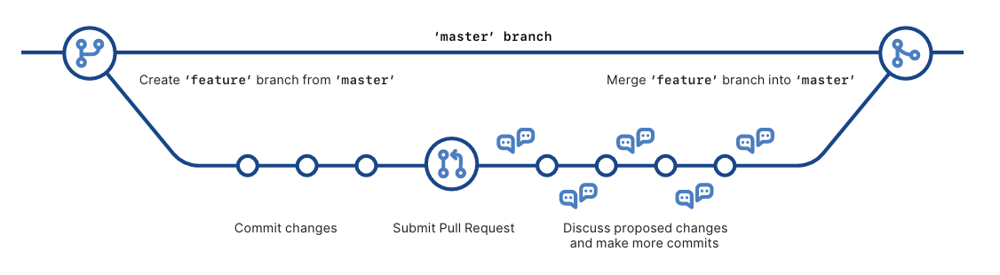

# GIT COMMANDS

## Table of Contents
- [GIT COMMANDS](#git-commands)
  - [Table of Contents](#table-of-contents)
  - [Configure tooling](#configure-tooling)
  - [Create repositories](#create-repositories)
  - [GitHub Flow](#github-flow)
  - [Glossary](#glossary)

## Configure tooling

Configure user information for all local repositories

```
$ git config --global init.defaultBranch main
```

Sets the name you want attached to your commit transactions
```
$ git config --global user.name "Your Name"
```

Sets the email you want attached to your commit transactions
```
$ git config --global user.email "you@example.com"
```

Enables helpful colorization of command line output
```
$ git config --global color.ui auto
```

## Create repositories

When starting out with a new repository, you only need to do it once; either locally, then push to GitHub, or by cloning an existing repository.

Turn an existing directory into a git repository
```
$ git init
```

Clone (download) a repository that already exists on GitHub, including all of the files, branches, and commits
```
$ git clone [url]
```

git status

git add .

git commit -m "Initial commit."

git commit -a

## GitHub Flow


## Glossary

* **git**: an open source, distributed version-control system 
* **GitHub**: a platform for hosting and collaborating on Git repositories 
* **commit**: a Git object, a snapshot of your entire repository compressed into a SHA 
* **branch**: a lightweight movable pointer to a commit 
* **clone**: a local version of a repository, including all commits and branches 
* **remote**: a common repository on GitHub that all team member use to exchange their changes 
* **fork**: a copy of a repository on GitHub owned by a different user 
* **pull request**: a place to compare and discuss the differences introduced on a branch with reviews, comments, integrated tests, and more 
* **HEAD**: representing your current working directory, the HEAD pointer can be moved to different branches, tags, or commits when using git checkout